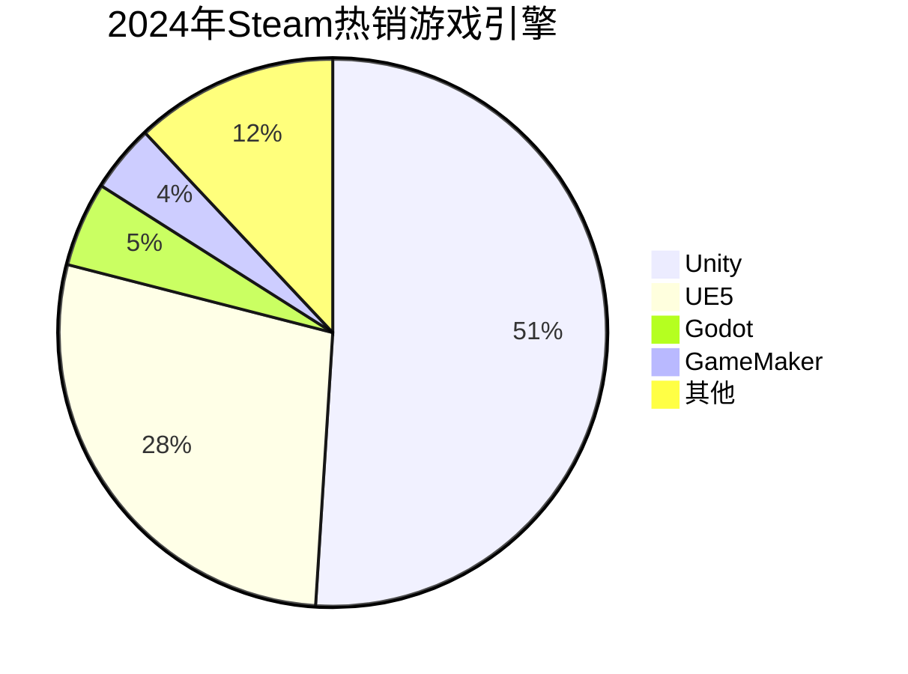

为什么选择Unity?
---

>数据来自于[*网址*]("https://80.lv/articles/less-than-10-of-games-released-on-steam-in-2024-were-made-with-proprierary-engines")
 
Unity 是游戏开发（尤其新手入门、跨平台开发）的高性价比选择，核心优势集中在“易上手、生态全、需求广”，适配从独立开发者到商业团队的多元场景。

1. **学习门槛低，上手成本友好**  
   对新手友好，可视化编辑器操作直观，支持C#（语法严谨且行业通用）和UnityScript，教程、社区答疑资源丰富，从零到做出简单demo的周期短。

2. **生态体系完善，资源复用率高**  
   Asset Store 提供海量现成素材、插件（如地形生成、UI组件、物理效果工具），可大幅节省开发时间；第三方工具（如Cinemachine相机系统、ProBuilder建模工具）集成度高，无需从零搭建基础功能。

3. **跨平台能力强大，适配多终端**  
   一次开发可导出至PC、移动端（iOS/Android）、主机（PS/Xbox/Switch）、VR/AR等多个平台，无需针对不同设备单独重构代码，降低多端发布成本，覆盖更广泛用户群体。

4. **就业与商业落地需求旺盛**  
   游戏行业（手游、独立游戏、中小团队商业项目）对Unity人才需求稳定，相关岗位数量多；除游戏外，还可应用于AR/VR、虚拟仿真、建筑可视化等领域，职业发展路径多元。

5. **2D/3D开发兼顾，适配多类型项目**  
   既擅长2D游戏开发（Tilemap、2D物理引擎优化成熟），也能满足3D游戏、半开放世界等中重度项目需求，适配从休闲小游戏到中等规模商业项目的开发场景。
---
## 第一部分：Unity的下载与安装
1. 访问Unity中国官方网站：https://unity.cn/
2. 在官网对应下载区域，获取 **Tuanjie Hub**
3. 在 **Tuanjie Hub**中安装 **Unity Hub**
4. 运行安装包，按照软件内置指引完成安装流程
## 第二部分: 开始自己的第一个2D项目
**[👉 点击跳转到教学视频](#unity-learn)**
1. 获取素材: [Unity商店](https://assetstore-fallback.unity.com/?locale=zh-CN) &nbsp;&nbsp;[Pixlab24](https://pixlab24.com/)
> 推荐使用(Pixel Adventure 1)的免费素材学习制作横板游戏

2. 创建自己的项目 推荐2D(Built-In Render Pipeline)
3. 学习创建Object , 绑定Sprite, 制作Animations
4. 通过Add Component , 给物体绑定碰撞箱等
5. 将写好的Script绑定到对象上

---

## 参考教程

<iframe width="100%" height="468" src="//player.bilibili.com/player.html?bvid=BV1k64y1N7MV&p=1&autoplay=0" scrolling="no" border="0" frameborder="no" framespacing="0" allowfullscreen="true" &autoplay=0> </iframe>